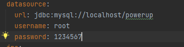
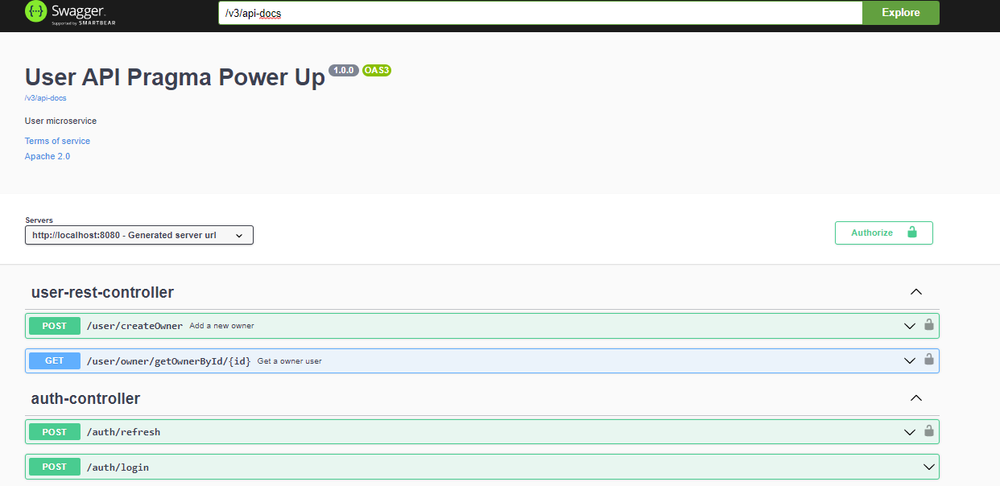
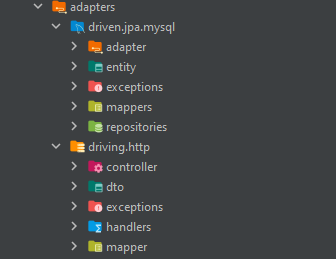
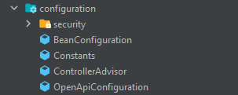
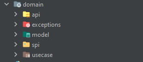

 

<h3 align="center">PRAGMA POWER-UP: USERMICROSERVICE</h3>
  

    This repository contains the microservice of users who register and enter according to their role (Admin, owner, client, employee). 
      In the database, the aforementioned roles are entered in the role table.
  

   

      The implementation of this microservice begins with the creation of the user with the owner role.
   

### Steps to keep in mind
It contains the connection with the relational database in MySql, for which the powerup name database must be created and 

   
### Built With

* 
* 
* 
* 

### Prerequisites

* JDK 17 [https://jdk.java.net/java-se-ri/17](https://jdk.java.net/java-se-ri/17)
* Gradle [https://gradle.org/install/](https://gradle.org/install/)
* MySQL [https://dev.mysql.com/downloads/installer/](https://dev.mysql.com/downloads/installer/)

### Recommended Tools
* IntelliJ Community [https://www.jetbrains.com/idea/download/](https://www.jetbrains.com/idea/download/)
* Postman [https://www.postman.com/downloads/](https://www.postman.com/downloads/)

<!-- GETTING STARTED -->
## Getting Started

To get a local copy up and running follow these steps:

1. Clone the repository
2. Create a database in MySql with the powerup
3. Update the credentials must be modified in the application-dev.yml file.
   

4. Run the microservice by right clicking on the UserMicroserviceApplication file and then on run
5. The port on which the microservice runs is 8080 which can be modified by entering the application-dev.yml file.
6. The documentation of the code is in the following link
   [http://localhost:8080/swagger-ui/index.html#](http://localhost:8080/swagger-ui/index.html) in your web browser

<!-- ROADMAP -->
## Tests

Right-click the test folder and choose Run tests with coverage:
- JUnit5 - Library used for testing
  
  
- Mockito - Framework used for code testing
  

- Jacoco - Test coverage tool
  

### Microservice structure

- Layer adpters

- Layer configuration

- Layer domain

### Author
[@LilianaGallego](https://github.com/LilianaGallego) - Liliana Gallego

